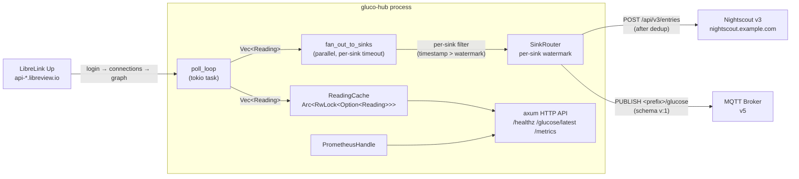
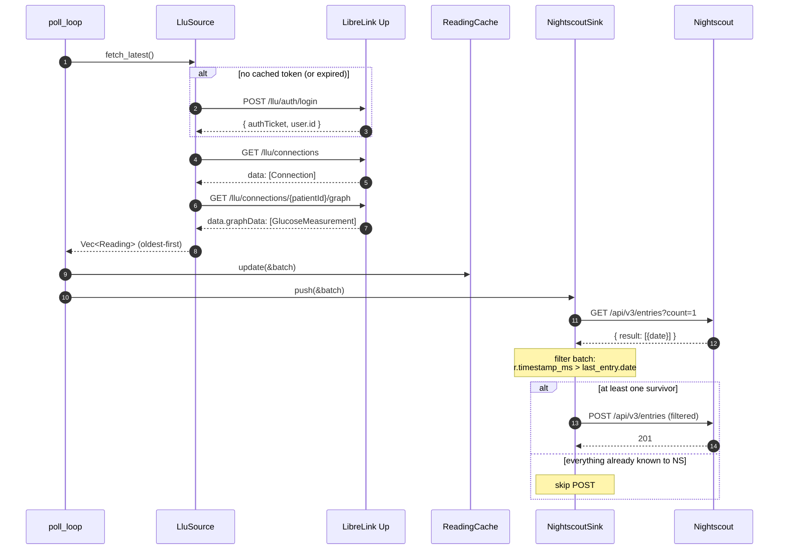
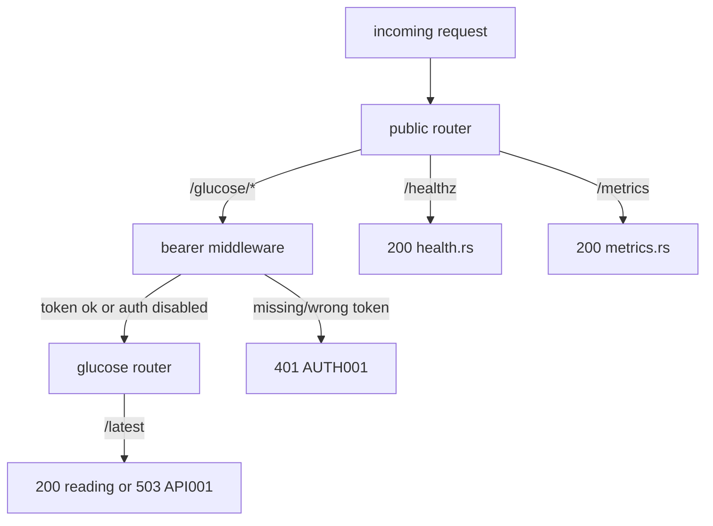

# gluco-hub architecture

This Rust workspace polls LibreLink Up, caches the latest readings in
memory, exposes them over HTTP, and pushes them to Nightscout. It contains
two crates:

- **`gluco-hub-core`** — pure domain. `Reading`, newtype IDs
  (`PatientId`, `SourceId`, `GlucoseMgDl`), the `Source` and `Sink`
  async traits, the `ReadingCache`, and the `CoreError` type. Contains
  only data and traits — no `reqwest`, `axum`, or `tokio` runtime.
- **`gluco-hub`** — the binary; wires concrete `Source` /
  `Sink` impls, the axum HTTP server, the metrics exporter, the
  config loader, the poll loop, and every CLI subcommand.

## Data flow



## One poll cycle



## Build identity

`gluco_hub_build_info{version, git_sha, features}` is a constant
gauge set to `1` on first scrape. Joining other metrics on this
label-set lets dashboards group by build — useful for "which build
is leaking?" post-mortems and for sanity-checking that a deployment
rolled. `version` is `CARGO_PKG_VERSION`, `git_sha` is
`option_env!("GLUCO_HUB_GIT_SHA")` (set by CI:
`GLUCO_HUB_GIT_SHA=$(git rev-parse HEAD) cargo build`; falls back
to `"unknown"` for ad-hoc dev builds), `features` is the alphabetical,
comma-joined list of enabled Cargo features.

## HTTP routing



`/glucose/*` runs through `axum::middleware::from_fn_with_state` only
when `GLUCO_HUB__HTTP__BEARER_TOKEN` is set. `/healthz` and
`/metrics` always stay public.

## Error-code namespaces

Every error variant in this codebase carries a stable `[XXXNNN]`
prefix in its `Display` impl. The same prefix appears in JSON logs
under `error_code` and in metric labels under
`cgm_source_fetch_errors_total{error_code}` and
`cgm_sink_push_errors_total{error_code}`. The `scripts/*-dryrun.sh`
exit-code contracts are also keyed off these prefixes via
`classify_by_prefix` in `main.rs`.

| Prefix | Source                                | Meaning |
| ------ | ------------------------------------- | ------- |
| CORE001 | `gluco-hub-core/src/error.rs`       | invalid glucose value |
| CORE002 | `gluco-hub-core/src/error.rs`       | invalid identifier (`PatientId`/`SourceId`) |
| CORE003 | `gluco-hub-core/src/error.rs`       | source error (wrapper) |
| CORE004 | `gluco-hub-core/src/error.rs`       | sink error (wrapper) |
| CFG001  | `gluco-hub/src/config.rs`           | failed to read or deserialize config (missing required field, bad value) |
| CFG002  | `gluco-hub/src/config.rs`           | config validation failed (validator) |
| CFG003  | `gluco-hub/src/config.rs`           | failed to read secret file (`password_file`) |
| CFG004  | `gluco-hub/src/config.rs`           | secret file is empty |
| CFG005  | `gluco-hub/src/main.rs`             | dryrun called without required `[…]` config block |
| CFG006  | `gluco-hub/src/config.rs`           | TOML references a Source/Sink whose Cargo feature is not compiled in |
| CFG007  | `gluco-hub/src/config.rs`           | a referenced secret env var resolved to an empty string |
| API001  | `gluco-hub/src/api/glucose.rs`      | `/glucose/latest` cache empty (503) |
| AUTH001 | `gluco-hub/src/api/auth.rs`         | missing or invalid bearer token (401) |
| LLU001  | `gluco-hub/src/sources/llu/error.rs`| HTTP transport error |
| LLU002  | `gluco-hub/src/sources/llu/error.rs`| LLU returned non-success status |
| LLU003  | `gluco-hub/src/sources/llu/error.rs`| invalid credentials (401 / status:2) |
| LLU004  | `gluco-hub/src/sources/llu/error.rs`| malformed response body |
| LLU005  | `gluco-hub/src/sources/llu/error.rs`| region redirect loop / too many redirects |
| LLU006  | `gluco-hub/src/sources/llu/error.rs`| unknown LibreLink Up region |
| LLU007  | `gluco-hub/src/sources/llu/error.rs`| could not parse LLU timestamp |
| LLU008  | `gluco-hub/src/sources/llu/error.rs`| LLU rejected token on a data endpoint (401) |
| LLU009  | `gluco-hub/src/sources/llu/error.rs`| no LLU connection matched selection |
| NS001   | `gluco-hub/src/sinks/nightscout/client.rs` | HTTP transport error |
| NS002   | `gluco-hub/src/sinks/nightscout/client.rs` | Nightscout rejected api-secret (401) |
| NS003   | `gluco-hub/src/sinks/nightscout/client.rs` | Nightscout returned non-success status |
| NS004   | `gluco-hub/src/sinks/nightscout/client.rs` | Nightscout returned a transient error (5xx, 429) |
| NS005   | `gluco-hub/src/sinks/nightscout/client.rs` | invalid Nightscout base URL |
| MQTT001 | `gluco-hub/src/sinks/mqtt/error.rs` | TCP / socket-level transport failure |
| MQTT002 | `gluco-hub/src/sinks/mqtt/error.rs` | TLS handshake failed |
| MQTT003 | `gluco-hub/src/sinks/mqtt/error.rs` | Broker refused CONNECT (auth, banned client-id, busy) |
| MQTT004 | `gluco-hub/src/sinks/mqtt/error.rs` | Publish channel closed or full (EventLoop dead) |
| MQTT005 | `gluco-hub/src/sinks/mqtt/error.rs` | Local payload / serialisation error |
| MQTT006 | `gluco-hub/src/sinks/mqtt/error.rs` | Keep-alive timeout |
| MQTT007 | `gluco-hub/src/sinks/mqtt/error.rs` | MQTT protocol-state error / unexpected packet |

## Cargo features

| Feature           | Crate(s)             | Effect |
| ----------------- | -------------------- | ------ |
| `source-llu`      | `gluco-hub`         | **Default.** Real LibreLink Up source. Honours `[source.llu]`; takes precedence over `mock-source`. Activates `dep:sha2`. |
| `sink-nightscout` | `gluco-hub`         | **Default.** Nightscout v3 sink. Honours `[sink.nightscout]`; fans out from the poller. Activates `dep:sha1`. |
| `sink-mqtt`       | `gluco-hub`         | V2 MQTT v5 sink (rumqttc 0.25, rustls only). Honours `[sink.mqtt]`; LWT-driven `_health` topic, schema `v: 1` glucose payload, exponential reconnect backoff. Activates `dep:rumqttc`, `dep:bytes`, `dep:tokio-util`. Bundled in published GHCR images. |
| `mock-source`     | `gluco-hub`, `gluco-hub-core` | In-memory canned source for offline tests; opt-in only. |

`build_default_source(&Config)` and `build_sinks(&Config)` in
`main.rs` apply the feature gates at runtime. `verify_features(&Config)`
runs at startup (and on `check-config`) and rejects with `[CFG006]` if
the TOML references a Source/Sink whose feature is not compiled in —
a clear startup error beats silent data loss.

### Two layers, one decision per Source/Sink

Source/Sink activation is the product of two independent gates:

1. **Compile-time (Cargo feature).** Decides whether the code (and its
   dependency tree — `rumqttc`, `bytes`, `tokio-util` for MQTT, `sha1`
   for Nightscout, …) is in the binary at all. Optimises image size
   and `cargo deny` audit surface.
2. **Runtime (TOML block presence).** Decides whether a compiled-in
   sink actually runs in this deployment. `build_sinks` only pushes a
   sink onto the fan-out vector when the corresponding `[sink.…]`
   block is present in the loaded config.

Truth table for a single Sink (Source is symmetric):

| Cargo feature | TOML block | Result |
| ------------- | ---------- | ------ |
| on            | present    | sink runs |
| on            | absent     | sink silently skipped (intentional — operator opted out of this deployment) |
| off           | absent     | sink not in binary; no-op |
| off           | present    | `[CFG006]` at startup — operator intent vs. build reality mismatch |

The published GHCR image enables every stable feature, so only the
runtime layer matters for most operators: drop a `[sink.…]` block from
`config.toml` to disable that sink. The compile-time layer serves
operators who build their own image and want a smaller binary or
tighter audit surface.

## Configuration reference

All keys live in TOML; `GLUCO_HUB__SECTION__KEY=…` overrides any value at
runtime (double underscore as separator). Supply secrets through
environment variables — never embed them in TOML.

| TOML path                           | Type     | Required | Validation | Notes |
| ----------------------------------- | -------- | -------- | ---------- | ----- |
| `[http] bind`                       | SocketAddr | yes (default `127.0.0.1:8080`) | parsed | |
| `[http] bearer_token`               | SecretString | no | — | supply via `GLUCO_HUB__HTTP__BEARER_TOKEN`; when set, /glucose/* requires `Authorization: Bearer <token>` |
| `[poller] interval_secs`            | u64      | yes (default `60`) | range 30..=600 | LLU updates every ~60 s |
| `[source.llu] email`                | string   | yes (LLU only) | email format | |
| `[source.llu] password`             | SecretString | one of `password`/`password_file` required | — | supply via `GLUCO_HUB__SOURCE__LLU__PASSWORD` |
| `[source.llu] password_file`        | path     | one of `password`/`password_file` required | readable file | 0600 file for Docker/K8s secrets; single trailing newline stripped |
| `[source.llu] region`               | string   | yes (LLU only) | matches the canonical region table | |
| `[source.llu] patient_id`           | string   | no       | 1..=128 chars | pin specific patient when account has multiple |
| `[source.llu] version`              | string   | no       | 1..=32 ASCII graphic | LLU app version header; override without recompile via `GLUCO_HUB__SOURCE__LLU__VERSION` |
| `[source.llu] timezone`             | string   | no       | valid IANA name      | patient's local timezone for `Timestamp` conversion (default `UTC`) |
| `[sink.nightscout] base_url`        | string   | yes (NS only) | starts with `http://` or `https://`, 5..=512 chars | |
| `[sink.nightscout] api_secret`      | SecretString | yes (NS only) | — | supply via `GLUCO_HUB__SINK__NIGHTSCOUT__API_SECRET`; raw secret, NOT pre-hashed |
| `[sink.nightscout] device`          | string   | no       | 1..=128 chars | shows in NS UI source column (default `gluco-hub`) |
| `[sink.nightscout] app`             | string   | no       | 1..=128 chars | NS app field (default `gluco-hub`) |
| `[sink.mqtt] broker_host`           | string   | yes (MQTT only) | 1..=253 chars | hostname or IP, no scheme |
| `[sink.mqtt] broker_port`           | u16      | yes (MQTT only) | 1..=65535 | 1883 plain, 8883 TLS by IANA |
| `[sink.mqtt] client_id`             | string   | yes (MQTT only) | 1..=23 chars, `[A-Za-z0-9_-]` | conservative MQTT 5 limit |
| `[sink.mqtt] username`              | string   | no       | 1..=256 chars | optional |
| `[sink.mqtt] password`              | SecretString | no | — | supply via `GLUCO_HUB__SINK__MQTT__PASSWORD` |
| `[sink.mqtt] topic_prefix`          | string   | yes (MQTT only) | 1..=200 chars, no `+`/`#`, no leading/trailing `/` | publishes to `<prefix>/{glucose,_health,_stats}` |
| `[sink.mqtt] qos`                   | int      | no (default `1`) | 0\|1\|2 | glucose publish QoS |
| `[sink.mqtt] keep_alive_secs`       | u64      | no (default `30`) | 5..=300 | |
| `[sink.mqtt] session_expiry_secs`   | u32      | no (default `0`) | any | 0 = clean-start every connect |
| `[sink.mqtt] tls`                   | bool     | no (default `true`) | bool | flip to `false` only for local plaintext brokers |
| `[sink.mqtt] include_patient_id`    | bool     | no (default `true`) | bool | omit `patient` field from glucose payload when `false` |
| `[sink.mqtt] stats_interval_secs`   | u64      | no (default `60`) | 5..=3600 | refresh interval for the retained `_stats` snapshot |
| `[sink.mqtt] discovery_enabled`     | bool     | no (default `false`) | bool | opt-in HA MQTT auto-discovery |
| `[sink.mqtt] discovery_prefix`      | string   | no (default `homeassistant`) | 1..=200 chars, no `+`/`#`, no leading/trailing `/` | HA discovery topic prefix |
| `[sink.mqtt] device_name`           | string   | no | 1..=128 chars | friendly device name in HA; defaults to `Gluco Hub (<client_id>)` |

### Sink layering: SinkRouter → DlqSink → real sink (V3)

Every configured sink is wrapped twice:

```
Vec<Arc<SinkRouter>>            ← exposed to fan_out_to_sinks
        ↓                         (watermark filter; backfill semantics)
Arc<SinkRouter>
        ↓
Arc<DlqSink>                    ← persistent dead-letter queue
        ↓                         (failed pushes accumulate on disk,
Arc<dyn Sink>                     drain on next successful push)
        ↓
NightscoutSink / MqttSink       ← actual transport
```

`SinkRouter`'s watermark only advances when the layered push (DLQ drain
+ live batch) returns `Ok` — so the watermark is always at-or-behind
"all readings confirmed delivered to the wire".

### Per-sink watermark backfill (V3)

Every `Sink` is wrapped in a [`SinkRouter`](../gluco-hub/src/sink_router.rs)
that holds a per-sink `last_pushed_ts` watermark. The fan-out passes the
full source batch (LLU returns ~24 h of `graphData` per poll) through
each router, which drops readings `<= watermark` before calling
`Sink::push`. On a successful push the watermark advances to the highest
timestamp in the attempted slice; on failure it stays put and the next
poll-cycle naturally replays the missed window.

Two operational properties fall out:

* **Steady-state burst reduction.** After the first poll, each sink
  only sees the 1 new reading per cycle, not the full 288-reading
  `graphData` slab. Critical for the MQTT sink, which would otherwise
  publish 288 messages/minute.
* **Recovery without DLQ.** If a sink is offline for one or several
  cycles, the watermark holds. As soon as the sink recovers, the next
  successful `push` sends every reading newer than the watermark — a
  drop-in gap-fill within LLU's 24 h history. No persistent queue, no
  on-disk DLQ machinery.

Watermarks are in-memory only. After a process restart the first cycle
re-sends the full 24 h batch to each sink once (matching the prior
behaviour); persisting watermarks across restarts is tracked as part of
the V3 DLQ work. Two Prometheus counters expose the routing decisions:
`cgm_sink_filtered_total` (readings skipped by the watermark filter)
and `cgm_sink_replayed_total` (readings sent in recovery — `pushed - 1`
per cycle, since the steady-state new-reading-per-cycle does not count).

### Persistent dead-letter queue (V3)

`DlqSink` lives between `SinkRouter` and the real sink and persists
failed pushes to disk so they survive process restarts and outage
windows longer than LLU's 24 h `graphData` history.

On each `push(batch)`:

1. Merge the in-memory queue with `batch`, deduplicated by
   `(patient_id, timestamp)` and sorted oldest-first.
2. Enforce `max_entries` cap — overflow drops the oldest entries and
   bumps `cgm_dlq_evicted_total`.
3. Try the inner sink. On success: clear the queue, delete the file,
   bump `cgm_dlq_drained_total`. On failure: persist the merged set
   atomically (`tempfile::NamedTempFile::persist`) and bump
   `cgm_dlq_enqueued_total` by the number of newly-added readings.

On startup `DlqSink::open` reads any pre-existing JSONL file into the
in-memory queue, so the first push after a restart replays whatever
was outstanding when the previous run exited.

Per-sink files at `<state_dir>/dlq/<sink_name>.jsonl`, one JSON-encoded
`Reading` per line. Bounded by `[dlq] max_entries` (default 10000 ≈ 35
days at the LLU 5-min raster). Disable wholesale via `[dlq] enabled =
false`.

### Home Assistant MQTT auto-discovery (V3, opt-in)

When `discovery_enabled = true`, the sink publishes two retained config
messages per ConnAck — one per HA entity, both grouped under one device
via a shared `device.identifiers` value:

| Topic                                                                        | Entity        | State reads                       |
| ---------------------------------------------------------------------------- | ------------- | --------------------------------- |
| `<discovery_prefix>/sensor/gluco_hub_<client_id>_glucose/config`             | Glucose value | `value_json.mgdl` (or `.mmol`)    |
| `<discovery_prefix>/sensor/gluco_hub_<client_id>_trend/config`               | Trend (enum)  | `value_json.trend`                |

The **glucose entity**:

* reads its state from `<topic_prefix>/glucose` via
  `value_template = "{{ value_json.mgdl }}"` (or `.mmol` when
  `discovery_unit = "mmol"`),
* derives availability from `<topic_prefix>/_health` via the boolean
  `online` field,
* exposes the full glucose JSON body as entity attributes
  (`json_attributes_topic` = `<topic_prefix>/glucose`) so existing
  templates reading `state_attr('sensor.<...>_glucose', 'trend')` keep
  working,
* sets `state_class = "measurement"` so HA's long-term statistics
  recorder ingests the series.

The **trend entity** is a sibling sensor that:

* reads its state from the same `<topic_prefix>/glucose` topic via
  `value_template = "{{ value_json.trend }}"` — a single MQTT publish
  updates both entities,
* declares `device_class = "enum"` with every `Trend` variant in
  `options` (`Flat`, `SingleUp`, `FortyFiveUp`, `DoubleUp`,
  `FortyFiveDown`, `SingleDown`, `DoubleDown`, `NotComputable`,
  `RateOutOfRange`) so HA treats it as a finite-state text sensor,
* carries a fixed `icon: "mdi:trending-up"`. Directional arrow icons
  per trend variant are intentionally **not** in the discovery payload
  — HA's MQTT discovery does not support templated `icon` fields, and
  arrow rendering belongs on the dashboard (a `template`/`mushroom`
  card with a state→icon mapping).

Both entities also carry `has_entity_name: true` (HA renders them as
`<Device Name> Glucose` / `<Device Name> Trend` and respects user
renames) and an `origin: { name, sw_version, support_url }` block (HA
2024.6+ idiom; surfaces the integration name and gluco-hub-rs version
in HA's device picker).

The config payload shape is stable; field names match HA's [MQTT sensor
discovery schema](https://www.home-assistant.io/integrations/sensor.mqtt/)
verbatim. `unique_id` is derived from `client_id`, so renaming a
gluco-hub instance creates new HA entities rather than overwriting the
existing ones.

## Module map

```
gluco-hub-core/src/
├── lib.rs                  re-exports
├── model.rs                Reading, Trend, GlucoseMgDl, PatientId, SourceId
├── source.rs               Source trait
├── sink.rs                 Sink trait
├── cache.rs                ReadingCache
├── error.rs                CoreError
└── mock.rs                 MockSource (feature `mock-source`)

gluco-hub/src/
├── main.rs                 CLI (run / check-config / dryrun / ns-dryrun),
│                           poll loop + fan-out, source/sink builders
├── config.rs               Config + validators + resolve_secret_file
├── metrics.rs              Prometheus recorder + counter/gauge names
├── sink_router.rs          SinkRouter — per-sink watermark filter (V3)
├── dlq.rs                  DlqSink — persistent per-sink dead-letter queue (V3)
├── api/
│   ├── mod.rs              router + AppState
│   ├── auth.rs             bearer middleware (subtle::ConstantTimeEq)
│   ├── glucose.rs          GET /glucose/latest
│   ├── health.rs           GET /healthz
│   └── metrics.rs          GET /metrics
├── sources/
│   ├── mod.rs              gates llu by feature
│   └── llu/
│       ├── mod.rs          re-exports
│       ├── auth.rs         LluAuthClient: login + connections + graph
│       ├── headers.rs      version / product / User-Agent / account-id
│       ├── region.rs       Region enum + base URL table
│       ├── error.rs        LluError (LLU001..LLU009)
│       ├── wire.rs         JSON-shape types (Connection, GlucoseMeasurement)
│       ├── mapping.rs      Trend, timestamp, Reading conversions
│       └── source.rs       LluSource: token cache + 401 retry + Source impl
├── sinks/
│   ├── mod.rs              gates nightscout / mqtt by feature
│   ├── nightscout/
│   │   ├── mod.rs          re-exports
│   │   ├── wire.rs         NsEntry + NsDirection
│   │   ├── client.rs       NightscoutClient: post_entries, fetch_last_entry_date
│   │   └── sink.rs         NightscoutSink: pre-upload dedup + Sink impl
│   └── mqtt/
│       ├── mod.rs          re-exports + topic-layout doc
│       ├── error.rs        MqttError (MQTT001..MQTT007)
│       ├── stats.rs        MqttStatsState: live counters + snapshot
│       ├── wire.rs         GlucosePayload, HealthPayload, StatsPayload
│       └── sink.rs         MqttSink: poll + stats tasks + Sink impl
└── e2e_tests.rs            (test-only) full LLU → cache → NS via wiremock
```

