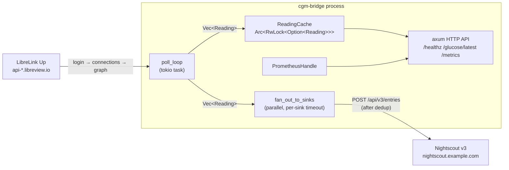
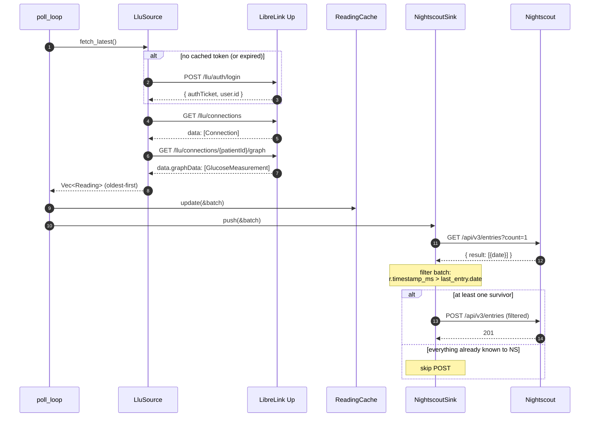
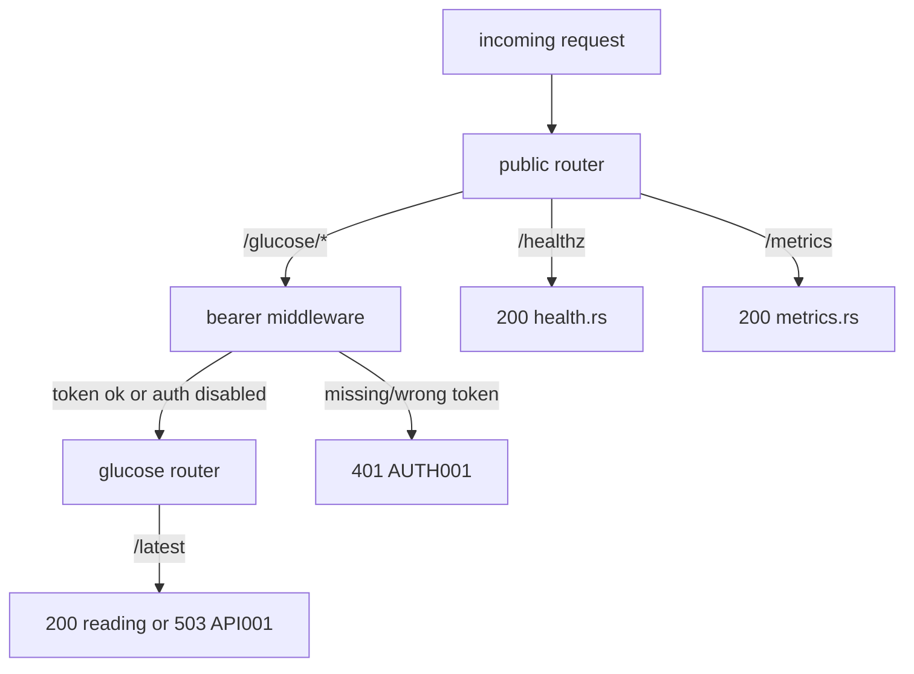

# cgm-bridge architecture

A Rust workspace that polls LibreLink Up, caches the latest readings in
memory, exposes them over HTTP, and pushes them to Nightscout. Two
crates:

- **`cgm-bridge-core`** — pure domain. `Reading`, newtype IDs
  (`PatientId`, `SourceId`, `GlucoseMgDl`), the `Source` and `Sink`
  async traits, the `ReadingCache`, and the `CoreError` type. No
  `reqwest`, no `axum`, no `tokio` runtime — just data + traits.
- **`cgm-bridge`** — the binary. Wires concrete `Source` /
  `Sink` impls, the axum HTTP server, the metrics exporter, the
  config loader, the poll loop, and every CLI subcommand.

## Data flow



## One poll cycle



## HTTP routing



`/glucose/*` runs through `axum::middleware::from_fn_with_state` only
when `[http] bearer_token_env` is configured. `/healthz` and
`/metrics` always stay public.

## Error-code namespaces

Every error variant in this codebase carries a stable `[XXXNNN]`
prefix in its `Display` impl. The same prefix appears in JSON logs
under `error_code` and in metric labels under
`cgm_source_fetch_errors_total{error_code}` and
`cgm_sink_push_errors_total{error_code}`. The `scripts/*-dryrun.sh`
exit-code contracts are also keyed off these prefixes via
`classify_by_prefix` in `main.rs`.

| Prefix | Source                                | Meaning |
| ------ | ------------------------------------- | ------- |
| CORE001 | `cgm-bridge-core/src/error.rs`       | invalid glucose value |
| CORE002 | `cgm-bridge-core/src/error.rs`       | invalid identifier (`PatientId`/`SourceId`) |
| CORE003 | `cgm-bridge-core/src/error.rs`       | source error (wrapper) |
| CORE004 | `cgm-bridge-core/src/error.rs`       | sink error (wrapper) |
| CFG001  | `cgm-bridge/src/config.rs`           | failed to read config file |
| CFG002  | `cgm-bridge/src/config.rs`           | config validation failed |
| CFG003  | `cgm-bridge/src/config.rs`           | required secret env var missing or empty |
| CFG004  | `cgm-bridge/src/main.rs`             | dryrun called without required `[…]` block |
| API001  | `cgm-bridge/src/api/glucose.rs`      | `/glucose/latest` cache empty (503) |
| AUTH001 | `cgm-bridge/src/api/auth.rs`         | missing or invalid bearer token (401) |
| LLU001  | `cgm-bridge/src/sources/llu/error.rs`| HTTP transport error |
| LLU002  | `cgm-bridge/src/sources/llu/error.rs`| LLU returned non-success status |
| LLU003  | `cgm-bridge/src/sources/llu/error.rs`| invalid credentials (401 / status:2) |
| LLU004  | `cgm-bridge/src/sources/llu/error.rs`| malformed response body |
| LLU005  | `cgm-bridge/src/sources/llu/error.rs`| region redirect loop / too many redirects |
| LLU006  | `cgm-bridge/src/sources/llu/error.rs`| unknown LibreLink Up region |
| LLU007  | `cgm-bridge/src/sources/llu/error.rs`| could not parse LLU timestamp |
| LLU008  | `cgm-bridge/src/sources/llu/error.rs`| LLU rejected token on a data endpoint (401) |
| LLU009  | `cgm-bridge/src/sources/llu/error.rs`| no LLU connection matched selection |
| NS001   | `cgm-bridge/src/sinks/nightscout/client.rs` | HTTP transport error |
| NS002   | `cgm-bridge/src/sinks/nightscout/client.rs` | Nightscout rejected api-secret (401) |
| NS003   | `cgm-bridge/src/sinks/nightscout/client.rs` | Nightscout returned non-success status |
| NS004   | `cgm-bridge/src/sinks/nightscout/client.rs` | Nightscout returned a transient error (5xx, 429) |
| NS005   | `cgm-bridge/src/sinks/nightscout/client.rs` | invalid Nightscout base URL |

## Cargo features

| Feature           | Crate(s)             | Effect |
| ----------------- | -------------------- | ------ |
| `mock-source`     | `cgm-bridge`, `cgm-bridge-core` | Default. Wires an in-memory canned source so the API runs out of the box. |
| `source-llu`      | `cgm-bridge`         | Real LibreLink Up source. Honours `[source.llu]`; takes precedence over `mock-source`. Activates `dep:sha2`. |
| `sink-nightscout` | `cgm-bridge`         | Nightscout v3 sink. Honours `[sink.nightscout]`; fans out from the poller. Activates `dep:sha1`. |

`build_default_source(&Config)` and `build_sinks(&Config)` in
`main.rs` apply the feature gates at runtime. A binary built with
`--no-default-features` parses every config block but registers
nothing — useful for compiled-in-but-disabled smoke checks.

## Configuration reference

All keys live in TOML; any value can be overridden at runtime via
`CGM_BRIDGE__SECTION__KEY=…` (double underscore as separator).
Secrets are NEVER stored in TOML — secret-bearing fields name an
environment variable, never the value.

| TOML path                           | Type     | Required | Validation | Notes |
| ----------------------------------- | -------- | -------- | ---------- | ----- |
| `[http] bind`                       | SocketAddr | yes (default `127.0.0.1:8080`) | parsed | |
| `[http] bearer_token_env`           | string   | no       | ASCII env-var name, 1..=256 chars | when set, /glucose/* requires `Authorization: Bearer <env-var-value>` |
| `[poller] interval_secs`            | u64      | yes (default `60`) | range 30..=600 | LLU updates every ~60 s |
| `[source.llu] email`                | string   | yes (LLU only) | email format | |
| `[source.llu] password_env`         | string   | yes (LLU only) | non-empty | name of env var holding LLU password |
| `[source.llu] region`               | string   | yes (LLU only) | matches the canonical region table | |
| `[source.llu] patient_id`           | string   | no       | 1..=128 chars | pin specific patient when account has multiple |
| `[source.llu] version`              | string   | no       | 1..=32 ASCII graphic | LLU app version header (default `4.16.0`) |
| `[sink.nightscout] base_url`        | string   | yes (NS only) | starts with `http://` or `https://`, 5..=512 chars | |
| `[sink.nightscout] api_secret_env`  | string   | yes (NS only) | ASCII env-var name | name of env var holding raw NS api secret |
| `[sink.nightscout] device`          | string   | no       | 1..=128 chars | shows in NS UI source column (default `cgm-bridge`) |
| `[sink.nightscout] app`             | string   | no       | 1..=128 chars | NS app field (default `cgm-bridge`) |

## Module map

```
cgm-bridge-core/src/
├── lib.rs                  re-exports
├── model.rs                Reading, Trend, GlucoseMgDl, PatientId, SourceId
├── source.rs               Source trait
├── sink.rs                 Sink trait
├── cache.rs                ReadingCache
├── error.rs                CoreError
└── mock.rs                 MockSource (feature `mock-source`)

cgm-bridge/src/
├── main.rs                 CLI (run / check-config / dryrun / ns-dryrun),
│                           poll loop + fan-out, source/sink builders
├── config.rs               Config + validators + resolve_secret_env
├── metrics.rs              Prometheus recorder + counter/gauge names
├── api/
│   ├── mod.rs              router + AppState
│   ├── auth.rs             bearer middleware (subtle::ConstantTimeEq)
│   ├── glucose.rs          GET /glucose/latest
│   ├── health.rs           GET /healthz
│   └── metrics.rs          GET /metrics
├── sources/
│   ├── mod.rs              gates llu by feature
│   └── llu/
│       ├── mod.rs          re-exports
│       ├── auth.rs         LluAuthClient: login + connections + graph
│       ├── headers.rs      version / product / User-Agent / account-id
│       ├── region.rs       Region enum + base URL table
│       ├── error.rs        LluError (LLU001..LLU009)
│       ├── wire.rs         JSON-shape types (Connection, GlucoseMeasurement)
│       ├── mapping.rs      Trend, timestamp, Reading conversions
│       └── source.rs       LluSource: token cache + 401 retry + Source impl
├── sinks/
│   ├── mod.rs              gates nightscout by feature
│   └── nightscout/
│       ├── mod.rs          re-exports
│       ├── wire.rs         NsEntry + NsDirection
│       ├── client.rs       NightscoutClient: post_entries, fetch_last_entry_date
│       └── sink.rs         NightscoutSink: pre-upload dedup + Sink impl
└── e2e_tests.rs            (test-only) full LLU → cache → NS via wiremock
```

## Reference

LLU specifics are verified against
<https://github.com/timoschlueter/nightscout-librelink-up>; concrete
field-by-field comparisons live in the doc comments at the top of
`sinks/nightscout/wire.rs` (entry shape) and
`sources/llu/mapping.rs` (timestamp choice and trend mapping).
