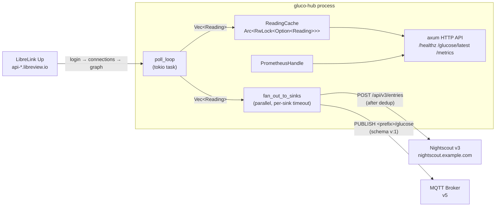
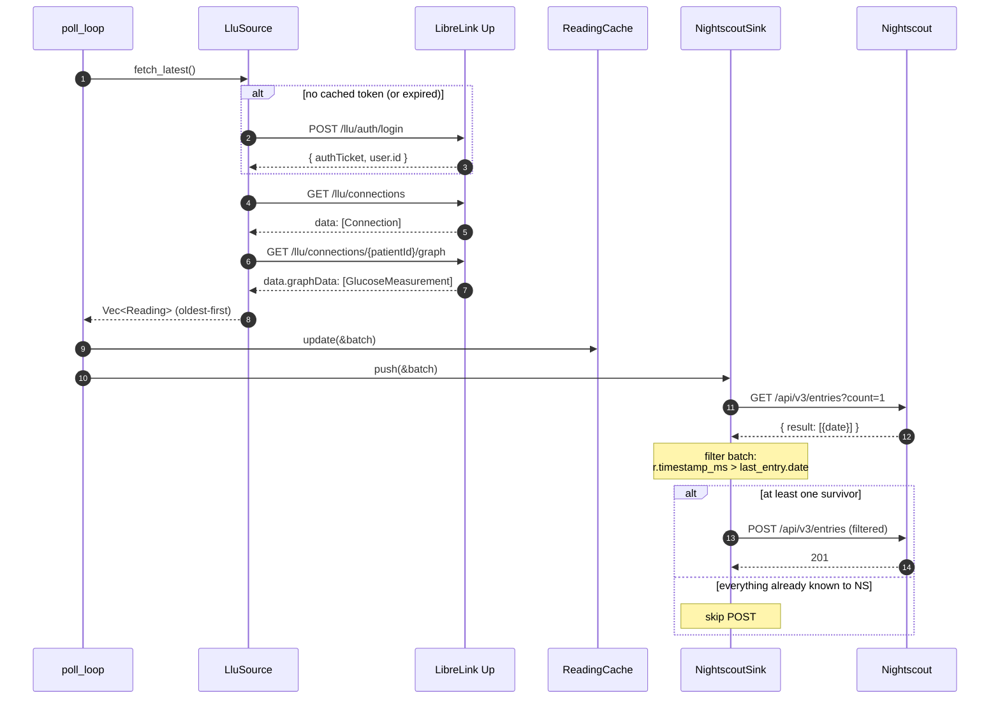
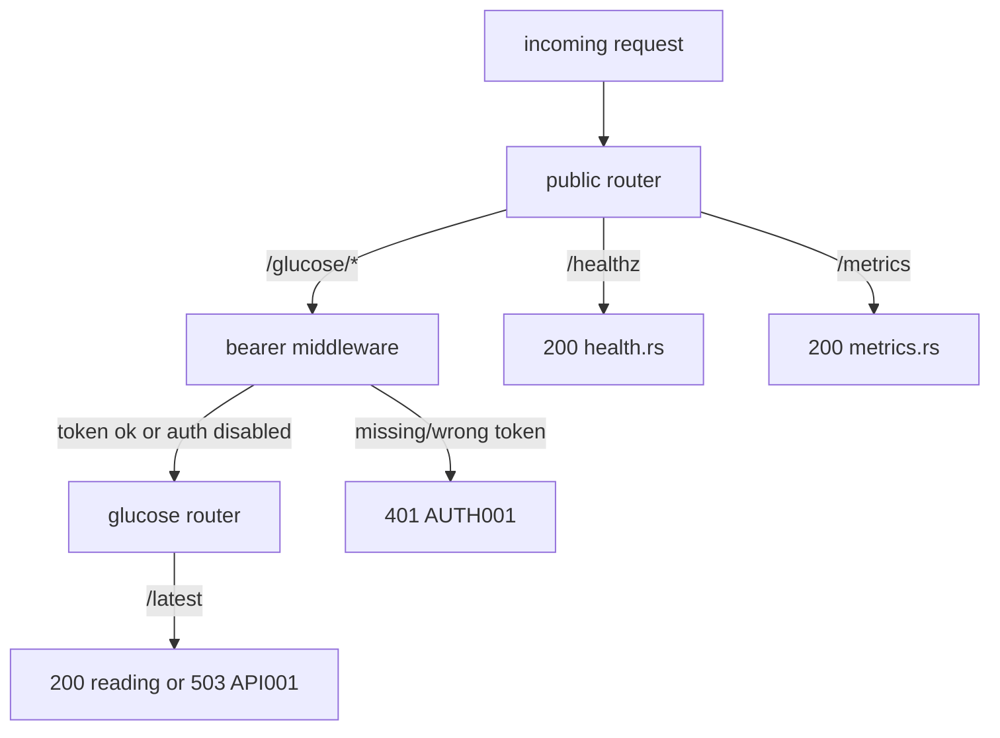

# gluco-hub architecture

A Rust workspace that polls LibreLink Up, caches the latest readings in
memory, exposes them over HTTP, and pushes them to Nightscout. Two
crates:

- **`gluco-hub-core`** — pure domain. `Reading`, newtype IDs
  (`PatientId`, `SourceId`, `GlucoseMgDl`), the `Source` and `Sink`
  async traits, the `ReadingCache`, and the `CoreError` type. No
  `reqwest`, no `axum`, no `tokio` runtime — just data + traits.
- **`gluco-hub`** — the binary. Wires concrete `Source` /
  `Sink` impls, the axum HTTP server, the metrics exporter, the
  config loader, the poll loop, and every CLI subcommand.

## Data flow



## One poll cycle



## Build identity

`gluco_hub_build_info{version, git_sha, features}` is a constant
gauge set to `1` on first scrape. Joining other metrics on this
label-set lets dashboards group by build — useful for "which build
is leaking?" post-mortems and for sanity-checking that a deployment
actually rolled. `version` is `CARGO_PKG_VERSION`, `git_sha` is
`option_env!("GLUCO_HUB_GIT_SHA")` (set by CI:
`GLUCO_HUB_GIT_SHA=$(git rev-parse HEAD) cargo build`; falls back
to `"unknown"` for ad-hoc dev builds), `features` is the alphabetical
comma-joined list of enabled Cargo features.

## HTTP routing



`/glucose/*` runs through `axum::middleware::from_fn_with_state` only
when `[http] bearer_token_env` is configured. `/healthz` and
`/metrics` always stay public.

## Error-code namespaces

Every error variant in this codebase carries a stable `[XXXNNN]`
prefix in its `Display` impl. The same prefix appears in JSON logs
under `error_code` and in metric labels under
`cgm_source_fetch_errors_total{error_code}` and
`cgm_sink_push_errors_total{error_code}`. The `scripts/*-dryrun.sh`
exit-code contracts are also keyed off these prefixes via
`classify_by_prefix` in `main.rs`.

| Prefix | Source                                | Meaning |
| ------ | ------------------------------------- | ------- |
| CORE001 | `gluco-hub-core/src/error.rs`       | invalid glucose value |
| CORE002 | `gluco-hub-core/src/error.rs`       | invalid identifier (`PatientId`/`SourceId`) |
| CORE003 | `gluco-hub-core/src/error.rs`       | source error (wrapper) |
| CORE004 | `gluco-hub-core/src/error.rs`       | sink error (wrapper) |
| CFG001  | `gluco-hub/src/config.rs`           | failed to read config file |
| CFG002  | `gluco-hub/src/config.rs`           | config validation failed |
| CFG003  | `gluco-hub/src/config.rs`           | required secret env var missing or empty |
| CFG004  | `gluco-hub/src/main.rs`             | dryrun called without required `[…]` block |
| API001  | `gluco-hub/src/api/glucose.rs`      | `/glucose/latest` cache empty (503) |
| AUTH001 | `gluco-hub/src/api/auth.rs`         | missing or invalid bearer token (401) |
| LLU001  | `gluco-hub/src/sources/llu/error.rs`| HTTP transport error |
| LLU002  | `gluco-hub/src/sources/llu/error.rs`| LLU returned non-success status |
| LLU003  | `gluco-hub/src/sources/llu/error.rs`| invalid credentials (401 / status:2) |
| LLU004  | `gluco-hub/src/sources/llu/error.rs`| malformed response body |
| LLU005  | `gluco-hub/src/sources/llu/error.rs`| region redirect loop / too many redirects |
| LLU006  | `gluco-hub/src/sources/llu/error.rs`| unknown LibreLink Up region |
| LLU007  | `gluco-hub/src/sources/llu/error.rs`| could not parse LLU timestamp |
| LLU008  | `gluco-hub/src/sources/llu/error.rs`| LLU rejected token on a data endpoint (401) |
| LLU009  | `gluco-hub/src/sources/llu/error.rs`| no LLU connection matched selection |
| NS001   | `gluco-hub/src/sinks/nightscout/client.rs` | HTTP transport error |
| NS002   | `gluco-hub/src/sinks/nightscout/client.rs` | Nightscout rejected api-secret (401) |
| NS003   | `gluco-hub/src/sinks/nightscout/client.rs` | Nightscout returned non-success status |
| NS004   | `gluco-hub/src/sinks/nightscout/client.rs` | Nightscout returned a transient error (5xx, 429) |
| NS005   | `gluco-hub/src/sinks/nightscout/client.rs` | invalid Nightscout base URL |
| MQTT001 | `gluco-hub/src/sinks/mqtt/error.rs` | TCP / socket-level transport failure |
| MQTT002 | `gluco-hub/src/sinks/mqtt/error.rs` | TLS handshake failed |
| MQTT003 | `gluco-hub/src/sinks/mqtt/error.rs` | Broker refused CONNECT (auth, banned client-id, busy) |
| MQTT004 | `gluco-hub/src/sinks/mqtt/error.rs` | Publish channel closed or full (EventLoop dead) |
| MQTT005 | `gluco-hub/src/sinks/mqtt/error.rs` | Local payload / serialisation error |
| MQTT006 | `gluco-hub/src/sinks/mqtt/error.rs` | Keep-alive timeout |
| MQTT007 | `gluco-hub/src/sinks/mqtt/error.rs` | MQTT protocol-state error / unexpected packet |

## Cargo features

| Feature           | Crate(s)             | Effect |
| ----------------- | -------------------- | ------ |
| `mock-source`     | `gluco-hub`, `gluco-hub-core` | Default. Wires an in-memory canned source so the API runs out of the box. |
| `source-llu`      | `gluco-hub`         | Real LibreLink Up source. Honours `[source.llu]`; takes precedence over `mock-source`. Activates `dep:sha2`. |
| `sink-nightscout` | `gluco-hub`         | Nightscout v3 sink. Honours `[sink.nightscout]`; fans out from the poller. Activates `dep:sha1`. |
| `sink-mqtt`       | `gluco-hub`         | V2 MQTT v5 sink (rumqttc 0.25, rustls only). Honours `[sink.mqtt]`; LWT-driven `_health` topic, schema `v: 1` glucose payload, exponential reconnect backoff. Activates `dep:rumqttc`, `dep:bytes`, `dep:tokio-util`. |

`build_default_source(&Config)` and `build_sinks(&Config)` in
`main.rs` apply the feature gates at runtime. A binary built with
`--no-default-features` parses every config block but registers
nothing — useful for compiled-in-but-disabled smoke checks.

## Configuration reference

All keys live in TOML; any value can be overridden at runtime via
`GLUCO_HUB__SECTION__KEY=…` (double underscore as separator).
Secrets are NEVER stored in TOML — secret-bearing fields name an
environment variable, never the value.

| TOML path                           | Type     | Required | Validation | Notes |
| ----------------------------------- | -------- | -------- | ---------- | ----- |
| `[http] bind`                       | SocketAddr | yes (default `127.0.0.1:8080`) | parsed | |
| `[http] bearer_token_env`           | string   | no       | ASCII env-var name, 1..=256 chars | when set, /glucose/* requires `Authorization: Bearer <env-var-value>` |
| `[poller] interval_secs`            | u64      | yes (default `60`) | range 30..=600 | LLU updates every ~60 s |
| `[source.llu] email`                | string   | yes (LLU only) | email format | |
| `[source.llu] password_env`         | string   | yes (LLU only) | non-empty | name of env var holding LLU password |
| `[source.llu] region`               | string   | yes (LLU only) | matches the canonical region table | |
| `[source.llu] patient_id`           | string   | no       | 1..=128 chars | pin specific patient when account has multiple |
| `[source.llu] version`              | string   | no       | 1..=32 ASCII graphic | LLU app version header (default `4.17.0`) |
| `[source.llu] timezone`             | string   | no       | valid IANA name      | patient's local timezone for `Timestamp` conversion (default `UTC`) |
| `[sink.nightscout] base_url`        | string   | yes (NS only) | starts with `http://` or `https://`, 5..=512 chars | |
| `[sink.nightscout] api_secret_env`  | string   | yes (NS only) | ASCII env-var name | name of env var holding raw NS api secret |
| `[sink.nightscout] device`          | string   | no       | 1..=128 chars | shows in NS UI source column (default `gluco-hub`) |
| `[sink.nightscout] app`             | string   | no       | 1..=128 chars | NS app field (default `gluco-hub`) |
| `[sink.mqtt] broker_host`           | string   | yes (MQTT only) | 1..=253 chars | hostname or IP, no scheme |
| `[sink.mqtt] broker_port`           | u16      | yes (MQTT only) | 1..=65535 | 1883 plain, 8883 TLS by IANA |
| `[sink.mqtt] client_id`             | string   | yes (MQTT only) | 1..=23 chars, `[A-Za-z0-9_-]` | conservative MQTT 5 limit |
| `[sink.mqtt] username`              | string   | no       | 1..=256 chars | optional |
| `[sink.mqtt] password_env`          | string   | no       | ASCII env-var name | name of env var holding MQTT password |
| `[sink.mqtt] topic_prefix`          | string   | yes (MQTT only) | 1..=200 chars, no `+`/`#`, no leading/trailing `/` | publishes to `<prefix>/{glucose,_health,_stats}` |
| `[sink.mqtt] qos`                   | int      | no (default `1`) | 0\|1\|2 | glucose publish QoS |
| `[sink.mqtt] keep_alive_secs`       | u64      | no (default `30`) | 5..=300 | |
| `[sink.mqtt] session_expiry_secs`   | u32      | no (default `0`) | any | 0 = clean-start every connect |
| `[sink.mqtt] tls`                   | bool     | no (default `true`) | bool | flip to `false` only for local plaintext brokers |
| `[sink.mqtt] include_patient_id`    | bool     | no (default `true`) | bool | omit `patient` field from glucose payload when `false` |
| `[sink.mqtt] stats_interval_secs`   | u64      | no (default `60`) | 5..=3600 | refresh interval for the retained `_stats` snapshot |

## Module map

```
gluco-hub-core/src/
├── lib.rs                  re-exports
├── model.rs                Reading, Trend, GlucoseMgDl, PatientId, SourceId
├── source.rs               Source trait
├── sink.rs                 Sink trait
├── cache.rs                ReadingCache
├── error.rs                CoreError
└── mock.rs                 MockSource (feature `mock-source`)

gluco-hub/src/
├── main.rs                 CLI (run / check-config / dryrun / ns-dryrun),
│                           poll loop + fan-out, source/sink builders
├── config.rs               Config + validators + resolve_secret_env
├── metrics.rs              Prometheus recorder + counter/gauge names
├── api/
│   ├── mod.rs              router + AppState
│   ├── auth.rs             bearer middleware (subtle::ConstantTimeEq)
│   ├── glucose.rs          GET /glucose/latest
│   ├── health.rs           GET /healthz
│   └── metrics.rs          GET /metrics
├── sources/
│   ├── mod.rs              gates llu by feature
│   └── llu/
│       ├── mod.rs          re-exports
│       ├── auth.rs         LluAuthClient: login + connections + graph
│       ├── headers.rs      version / product / User-Agent / account-id
│       ├── region.rs       Region enum + base URL table
│       ├── error.rs        LluError (LLU001..LLU009)
│       ├── wire.rs         JSON-shape types (Connection, GlucoseMeasurement)
│       ├── mapping.rs      Trend, timestamp, Reading conversions
│       └── source.rs       LluSource: token cache + 401 retry + Source impl
├── sinks/
│   ├── mod.rs              gates nightscout / mqtt by feature
│   ├── nightscout/
│   │   ├── mod.rs          re-exports
│   │   ├── wire.rs         NsEntry + NsDirection
│   │   ├── client.rs       NightscoutClient: post_entries, fetch_last_entry_date
│   │   └── sink.rs         NightscoutSink: pre-upload dedup + Sink impl
│   └── mqtt/
│       ├── mod.rs          re-exports + topic-layout doc
│       ├── error.rs        MqttError (MQTT001..MQTT007)
│       ├── stats.rs        MqttStatsState: live counters + snapshot
│       ├── wire.rs         GlucosePayload, HealthPayload, StatsPayload
│       └── sink.rs         MqttSink: poll + stats tasks + Sink impl
└── e2e_tests.rs            (test-only) full LLU → cache → NS via wiremock
```

