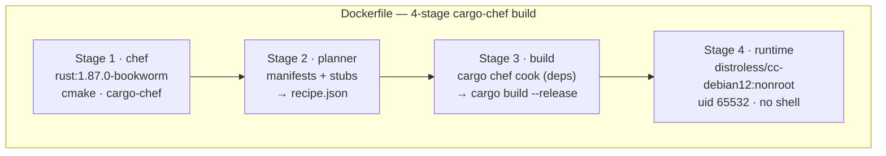
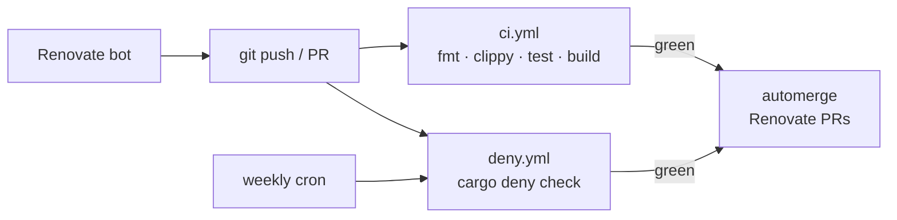

# gluco-hub — Operations

Runbook for endpoints, CLI, MQTT topics, metrics, configuration, troubleshooting, supply chain, and CI.

---

## CLI reference

```
gluco-hub [-c <config>] <subcommand>
```

| Subcommand     | Feature gate      | Purpose                                                   |
| -------------- | ----------------- | --------------------------------------------------------- |
| `run`          | —                 | Start the poll loop and HTTP API.                         |
| `check-config` | —                 | Validate config and exit (non-zero + `CFG0xx` on error).  |
| `dryrun`       | `source-llu`      | One-shot LLU probe; prints JSON summary, no server.       |
| `ns-dryrun`    | `sink-nightscout` | One-shot Nightscout read-only probe; never POSTs.         |

`dryrun` and `ns-dryrun` are also exposed via `scripts/llu-dryrun.sh` and `scripts/ns-dryrun.sh`
for use without a compiled binary.

---

## Endpoints

| Path              | Method | Auth            | Response                                     |
| ----------------- | ------ | --------------- | -------------------------------------------- |
| `/healthz`        | GET    | public          | `{"status":"ok","version":"…"}`              |
| `/metrics`        | GET    | public          | Prometheus text exposition (v0.0.4) — includes `patient_id` label on `cgm_glucose_mgdl`; protect at network/proxy layer if exposure is a concern |
| `/glucose/latest` | GET    | optional Bearer | latest cached reading or `503` + `API001`    |

`/glucose/*` becomes Bearer-protected when `GLUCO_HUB__HTTP__BEARER_TOKEN` is set; `/healthz` and `/metrics` always stay public.

---

## MQTT topics (V2)

Requires `--features sink-mqtt` and a `[sink.mqtt]` config block.

| Topic              | Retained | Payload                                                    |
| ------------------ | :------: | ---------------------------------------------------------- |
| `<prefix>/glucose` | No       | `{"v":1,"glucose_mgdl":…,"trend":…,"timestamp_utc":…}`    |
| `<prefix>/_health` | Yes      | `{"online":true}` · LWT: `{"online":false}`                |
| `<prefix>/_stats`  | No       | periodic stats payload                                     |

`<prefix>` is `topic_prefix` from `[sink.mqtt]` (e.g. `gluco-hub/gluco-hub-1`).

Home Assistant auto-discovery via MQTT is planned for V3.

---

## Metrics

Exported on `/metrics`:

| Metric                           | Type       | Labels                      |
| -------------------------------- | ---------- | --------------------------- |
| `cgm_cache_updates_total`        | counter    | —                           |
| `cgm_source_fetch_success_total` | counter    | `source_id`                 |
| `cgm_source_fetch_errors_total`  | counter    | `error_code`                |
| `cgm_sink_push_success_total`    | counter    | `sink`                      |
| `cgm_sink_push_errors_total`     | counter    | `sink`, `error_code`        |
| `cgm_sink_post_retry_total`      | counter    | `sink`, `attempt`           |
| `cgm_sink_dedup_skipped_total`   | counter    | `sink`                      |
| `cgm_glucose_mgdl`               | gauge      | `patient_id`, `source_id`   |
| `gluco_hub_build_info`          | gauge (=1) | `version`, `git_sha`, `features` |

Stable error-code prefixes (`CORE0xx`, `CFG0xx`, `API0xx`, `LLU0xx`, `NS0xx`, `AUTH0xx`, `MQTT0xx`) appear as metric labels and in JSON log fields so dashboards can use grep-clean rules across versions.

---

## Environment variables

| Variable               | Example                         | Effect                                       |
| ---------------------- | ------------------------------- | -------------------------------------------- |
| `GLUCO_HUB_LOG_PRETTY`| `1`                             | Human-readable logs instead of JSON (dev).   |
| `RUST_LOG`             | `gluco_hub=debug,reqwest=info` | Standard `tracing` filter.                   |

Config overrides: any TOML key can be overridden at runtime with `GLUCO_HUB__SECTION__KEY=…`
(double-underscore delimited), e.g. `GLUCO_HUB__HTTP__BIND=0.0.0.0:9090`.

Secrets are injected the same way — never embedded in TOML:

| Secret              | Environment variable                        | Holds                  |
| ------------------- | ------------------------------------------- | ---------------------- |
| LLU password        | `GLUCO_HUB__SOURCE__LLU__PASSWORD`          | LibreLink Up password  |
| Nightscout secret   | `GLUCO_HUB__SINK__NIGHTSCOUT__API_SECRET`   | Nightscout API secret  |
| HTTP Bearer token   | `GLUCO_HUB__HTTP__BEARER_TOKEN`             | API Bearer token       |
| MQTT password       | `GLUCO_HUB__SINK__MQTT__PASSWORD`           | MQTT broker password   |

The LLU password can alternatively be supplied via `password_file = "/run/secrets/…"` in `[source.llu]` — useful for Docker secrets and Kubernetes secret volumes.

Secrets never appear in TOML, logs, or `Debug` output.

---

## Graceful shutdown

`SIGINT` and `SIGTERM` both trigger graceful shutdown. In Docker / Kubernetes use the exec-form
`ENTRYPOINT` so PID 1 receives the signal directly without a shell wrapper.

Kubernetes liveness / readiness:

```yaml
livenessProbe:
  httpGet: { path: /healthz, port: 8080 }
  initialDelaySeconds: 5
readinessProbe:
  httpGet: { path: /glucose/latest, port: 8080 }
  failureThreshold: 5   # cache is empty before the first successful poll
```

---

## Container build



The dep-cook layer is cached until `Cargo.lock` / `Cargo.toml` changes. Source edits only rebuild from the `cargo build` step.

`GLUCO_HUB_GIT_SHA` populates `gluco_hub_build_info{git_sha=…}`; `BUILD_DATE` sets `org.opencontainers.image.created`.

---

## Troubleshooting

| Symptom | Likely cause | Fix |
| ------- | ------------ | --- |
| `[CFG001]` on startup | Missing required config field (e.g. `api_secret`) | Ensure the corresponding `GLUCO_HUB__*` env var is exported before starting. |
| `[CFG003]` on startup | `password_file` path not readable | Check the file path and permissions; the error message includes the path. |
| `[LLU002]` / `[LLU004]` | Wrong region or app version rejected | Check `region` in config; bump `version` via `GLUCO_HUB__SOURCE__LLU__VERSION=4.17.0`. |
| `[LLU003]` | Invalid credentials | Re-check email / password in the LibreLinkUp mobile app. |
| `[NS002]` | Wrong Nightscout api-secret | `GLUCO_HUB__SINK__NIGHTSCOUT__API_SECRET` must be the plain-text secret, not the SHA-1 hash. |
| `503` on `/glucose/latest` | Cache empty before first poll | Normal at startup; wait one poll interval (default 60 s). |
| App version rejected by LibreView | LibreView raised minimum version | Set `GLUCO_HUB__SOURCE__LLU__VERSION=4.17.0` (or latest) and restart. |

Full error-code reference: [`docs/ARCHITECTURE.md#error-code-namespaces`](./ARCHITECTURE.md#error-code-namespaces).

---

## Supply chain

`cargo deny check` enforces the policy in [`deny.toml`](../deny.toml):

- **licenses** — explicit allow-list (MIT, Apache-2.0, BSD-2/3, ISC, MPL-2.0, Zlib, CC0-1.0, Unicode-3.0/DFS-2016, CDLA-Permissive-2.0).
- **bans** — `openssl`, `openssl-sys`, `native-tls`, `git2` denied (rustls only).
- **sources** — only `crates.io`; git-deps and unknown registries fail.
- **advisories** — yanked crates fail.

```bash
cargo install --locked cargo-deny
cargo deny check
```

---

## Continuous integration

Two GitHub Actions workflows live under [`docs/ci/`](./ci/) and are not yet installed under `.github/workflows/` because the development token lacks the `workflow` scope. Install with a token that has `workflow`:

```bash
mkdir -p .github/workflows
cp docs/ci/ci-workflow.yml   .github/workflows/ci.yml
cp docs/ci/deny-workflow.yml .github/workflows/deny.yml
git add .github/workflows/
git commit -m "ci: install build + cargo-deny workflows"
git push
```

- **`ci.yml`** — `fmt` / `clippy` / `test` / release `build` on every push and PR. Wires `GLUCO_HUB_GIT_SHA=${{ github.sha }}` into the release build. Concurrency group cancels superseded PR runs; cache saves only on `main`.
- **`deny.yml`** — `cargo deny --all-features` on every push, PR, and weekly cron. Renovate is also configured — see [`renovate.json`](../renovate.json) — with grouped tokio / serde / axum+tower / tracing PRs, weekly `lockFileMaintenance`, and automerge gated on green CI.


